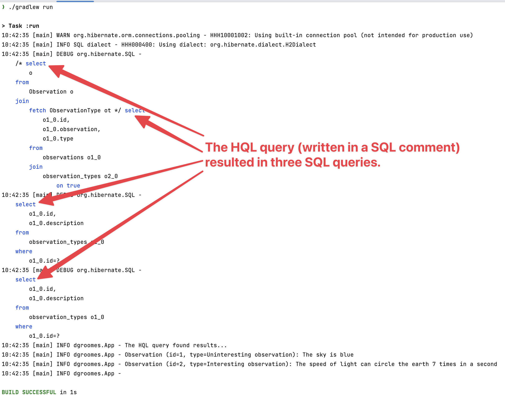

# hql

An illustration of Hibernate's *Hibernate Query Language* (HQL).


## Overview

The most technically impressive feature of Hibernate (and other ORMs) is their hallmark feature of turning row-based
data into graph-based data (and vice-versa). Specifically, this means turning the row-based data in the table of a SQL
database (RDBMS) into object instances in Java (object-to-object relationships form a graph). Across even a few tables,
it would require lots of procedural code to accomplish something similar if you weren't using an ORM. By contrast, for
single-table or non-relational information systems, consider using straight JDBC and SQL.

HQL is a powerful language that lets you re-use your existing SQL skills and get the full benefits of Hibernate's
object-relational mapping. This project implements a basic Java program that reads from a SQL database using HQL. It
alludes to the "n + 1 selects" problem and cites the `join fetch` feature. The Hibernate docs call out `join fetch` as an
important feature:

> This is one of the most important features of Hibernate. To achieve acceptable performance with HQL, you’ll need to
> use `join fetch` quite often. Without it, you’ll quickly run into the dreaded "n+1 selects" problem.
> 
> -- [Hibernate docs on `join fetch` in HQL](https://docs.jboss.org/hibernate/orm/6.2/userguide/html_single/Hibernate_User_Guide.html#hql-explicit-fetch-join)


## Instructions

Follow these instructions to run the demo:

1. Pre-requisite: Java 21
2. Run the program:
   * ```shell
     ./gradlew run
     ```
   * Altogether, it should look like this:
     ```text
     $ ./gradlew run
     
     > Task :run
     23:55:31 [main] WARN org.hibernate.orm.connections.pooling - HHH10001002: Using built-in connection pool (not intended for production use)
     23:55:31 [main] INFO dgroomes.App - The HQL query found results...
     23:55:31 [main] INFO dgroomes.App - Observation (id=1, type=Uninteresting observation): The sky is blue
     23:55:31 [main] INFO dgroomes.App - Observation (id=2, type=Interesting observation): The speed of light can circle the earth 7 times in a second
     23:55:31 [main] INFO dgroomes.App -
     ```
3. Try it again with `debug`-level logging
   * Edit the `src/main/resources/simplelogger.properties` file and uncomment the following line.
   * ```
     #org.slf4j.simpleLogger.log.org.hibernate.SQL=debug
     ```
   * Run the program again using the same command as before.
   * Notice the additional logging (screenshot). Specifically, the program issues three SQL statements to the H2 database.
     This is interesting because the program expresses only one HQL query. So, why did this result in three SQL queries?
     Read the official Hibernate and JPA docs to continue your learning, and always remember that logging and is your friend.
   * 
